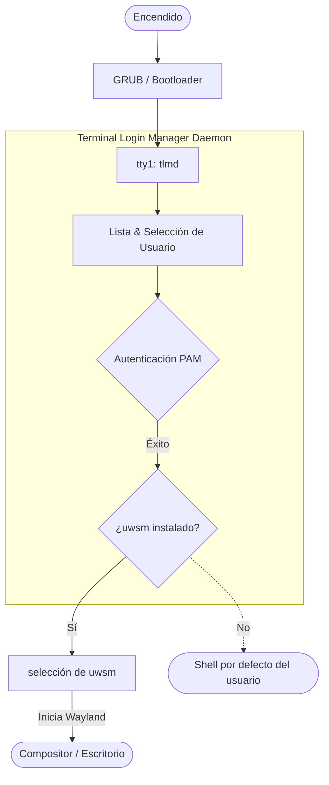

[](README.md)
[](README.es.md)

# TLMD (Terminal Login Manager Daemon)

**Una TUI minimalista y premium que reemplaza el tradicional prompt de `agetty` + `login`.**  
Autentica a los usuarios a través de PAM y transfiere el control de forma transparente a [uwsm](https://github.com/Vladimir-csp/uwsm) para gestionar la sesión en Wayland.

---

## Índice
- [Vistas Previas](#vistas-previas)
- [Características](#características)
- [Cómo Funciona](#cómo-funciona)
- [Instalación](#instalación)
- [Uso y Flags](#uso-y-flags)
- [Servicio Systemd](#servicio-systemd)
- [Desinstalación](#desinstalación)
- [Desarrollo](#desarrollo)
- [Tecnologías](#tecnologías)


## Vistas Previas

**Selección de Usuario**

*Selección de usuario elegante y filtrado en tiempo real.*

**Prompt de Contraseña**

*Entrada de contraseña segura y oculta con feedback visual instantáneo.*

---


## Características

- **Autenticación PAM:** Integración directa de PAM en la TTY. Sin daemons gráficos, sin dependencia de D-Bus al momento de iniciar sesión.
- **Selección de Usuario y Búsqueda:** Navegá entre los usuarios del sistema con `↑`/`↓` + `Enter`. ¡También podés escribir directamente para buscar y filtrar usuarios al instante!
- **Estética Negro Puro:** Fondo `#000000`, texto `#ffffff`, bordes `#888888` (DIM). Amigable con pantallas OLED, cero ruido visual, matemáticamente centrado a la perfección.
- **Memoria Segura:** Escrito en Rust (edición 2024). Esto es crítico ya que `tlmd` se ejecuta como root antes de que se complete la autenticación.

---


## Cómo Funciona

A diferencia de los gestores de pantalla gráficos pesados (como GDM o SDDM), `tlmd` se ejecuta puramente en la TTY. Actúa como el puente directo entre el inicio de tu sistema y tu compositor Wayland.



> [!NOTE]
> **Seguridad de Respaldo:** Si `uwsm` no está instalado o falla al iniciar (ej., por falta de compositor o error de driver), `tlmd` no te dejará bloqueado. Volverá de forma segura a ejecutar tu shell por defecto (`/bin/bash` o `/bin/zsh`) allí mismo en la TTY.

---


## Instalación

---

**Requisitos previos:** Necesitarás los headers de desarrollo de PAM instalados en tu sistema para compilar `pam-client2`.
- Arch Linux: `pacman -S pam`
- Debian/Ubuntu: `apt install libpam0g-dev`
- Fedora/RHEL: `dnf install pam-devel`

**Construcción e Instalación:**
```bash
# Clonar el repositorio
git clone https://github.com/yourusername/tlmd.git
cd tlmd

# Compilar versión release
cargo build --release

# Mover el binario a tu path del sistema
sudo cp target/release/tlmd /usr/local/bin/
```


## Uso y Flags

Por defecto, `tlmd` inicia en modo minimalista sin ningún logo. Sin embargo, podés activar hermosos logos ASCII pasando flags al ejecutar el daemon.

> [!TIP]
> Los logos ASCII se centran dinámicamente usando las dimensiones exactas de tu pantalla, asegurando que nunca rompan el diseño o se superpongan con las cajas de la UI.

### Por Defecto (Sin Ícono)
```bash
tlmd
```

### Logo Relleno
```bash
tlmd --icon=filled
```
```text
   ▄███████████▄   
  ▀▀▀█████████▀▀▀  
 ▄▀▀▄ ▀█████▀ ▄▀▀▄ 
▀▄  ▄▀ █▀▀▀█ ▀▄  ▄▀
▄ ▀▀ ▄▀     ▀▄ ▀▀ ▄
██████▄     ▄██████
████████▄ ▄████████
███████████████████
▀█████████████████▀
  ▀█████████████▀  
```

### Logo Contorneado
```bash
tlmd --icon=outline
```
```text
    ▄▀▀▀▀▀▀▀▀▀▀▀▄    
   ▀             ▀   
 ▄▀▀▀▀▄       ▄▀▀▀▀▄ 
█ ▄██▄ █     █ ▄██▄ █
█▄ ▀▀ ▄▀▄▀▀▀▄▀▄ ▀▀ ▄█
█ ▀▀▀▀ █     █ ▀▀▀▀ █
█       ▀▄ ▄▀       █
█         ▀         █
█                   █
▀▄                 ▄▀
  ▀▄▄▄▄▄▄▄▄▄▄▄▄▄▄▄▀  
```


## Servicio Systemd

---

Para que `tlmd` arranque automáticamente al encender tu TTY principal (`tty1`), necesitás crear un servicio systemd.

1. Creá un nuevo archivo de servicio en `/etc/systemd/system/tlmd.service`:
```ini
[Unit]
Description=Terminal Login Manager Daemon
Documentation=https://github.com/yourusername/tlmd
After=systemd-user-sessions.service plymouth-quit-wait.service
Conflicts=getty@tty1.service

[Service]
ExecStart=/usr/local/bin/tlmd --icon=outline
Type=idle
StandardInput=tty
StandardOutput=tty
TTYPath=/dev/tty1
TTYReset=yes
TTYVHangup=yes

[Install]
WantedBy=graphical.target
```

2. Deshabilitá el `agetty` por defecto en la `tty1` y habilitá `tlmd`:
```bash
sudo systemctl disable getty@tty1.service
sudo systemctl enable tlmd.service
```


## Desinstalación

---

Si querés volver al prompt de login por defecto de Linux:

```bash
# 1. Deshabilitar tlmd y volver a habilitar agetty en tty1
sudo systemctl disable tlmd.service
sudo systemctl enable getty@tty1.service

# 2. Eliminar el archivo del servicio systemd
sudo rm /etc/systemd/system/tlmd.service
sudo systemctl daemon-reload

# 3. Eliminar el binario
sudo rm /usr/local/bin/tlmd
```


## Desarrollo

---

Si querés modificar `tlmd` o probarlo localmente sin instalarlo como servicio:

```bash
# Ejecutar localmente (probando tu propio usuario)
cargo run

# Ejecutar como root (requerido para autenticar a OTROS usuarios)
cargo build
sudo ./target/debug/tlmd
```

> [!NOTE]
> Si ejecutás `cargo run` sin `sudo`, PAM te restringe para que sólo puedas autenticar el usuario con el que tenés la sesión iniciada actualmente. Debés compilar el binario y ejecutarlo con `sudo` para probar la autenticación en otras cuentas.


## Tecnologías

- **Rust:** Diseñado para velocidad y seguridad.
- **crossterm:** Para un renderizado puro de terminal multiplataforma.
- **pam-client2:** Para una autenticación robusta.
- **Renderizado directo en TTY:** No requiere emulador de terminal pesado ni dependencias de X11/Wayland para iniciar.

> [!CAUTION]
> **Requisitos de Privilegios:** Debido a que `tlmd` autentica usuarios y gestiona el inicio de sesión, debe ejecutarse con privilegios de `root` al iniciar (usualmente a través de un servicio systemd). Ejecutarlo como un usuario normal hará que los chequeos de autenticación PAM fallen.
