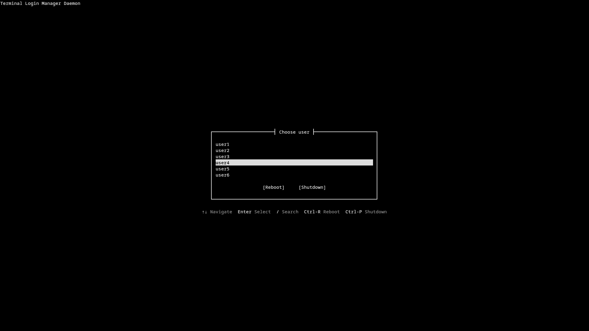
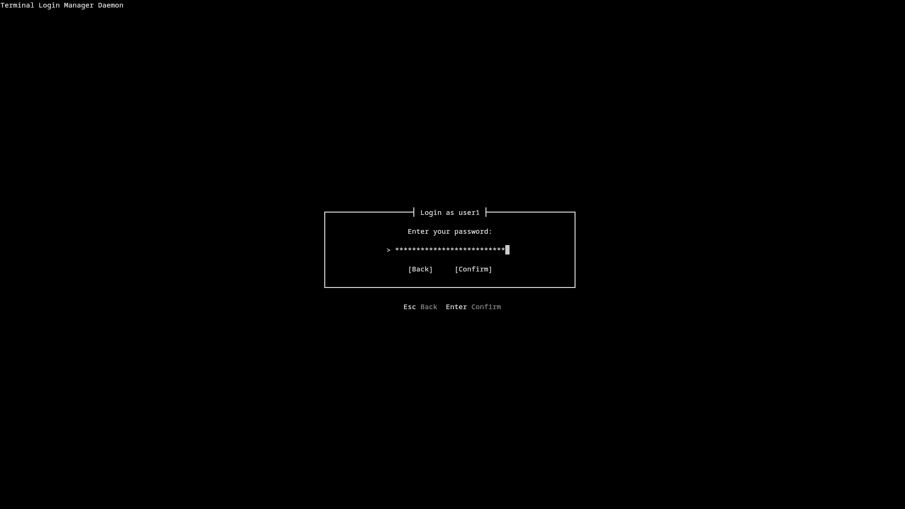
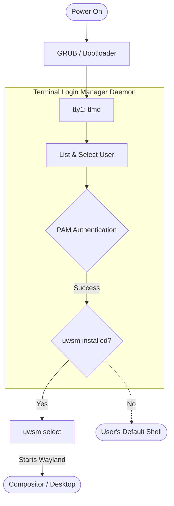

[](README.md)
[](README.es.md)

# TLMD (Terminal Login Manager Daemon)
  
**A minimal, premium TUI that replaces the traditional `agetty` + `login` prompt.**  
It authenticates users via PAM and seamlessly hands off control to [uwsm](https://github.com/Vladimir-csp/uwsm) for Wayland session management.

---

## Table of Contents
- [Previews](#previews)
- [Features](#features)
- [How it Works](#how-it-works)
- [Installation](#installation)
- [Usage & Flags](#usage--flags)
- [Systemd Service](#systemd-service)
- [Uninstallation](#uninstallation)
- [Development](#development)
- [Tech Stack](#tech-stack)


## Previews

**User Selection**

*Sleek user selection and real-time filtering.*

**Password Prompt**

*Secure, masked password input with instant visual feedback.*

---


## Features

- **PAM Authentication:** Direct PAM integration on the TTY. No graphical daemons, no D-Bus dependency at login time.
- **User Selection & Search:** Navigate system users with `↑`/`↓` + `Enter`. You can also type directly to search and filter users instantly!
- **True Black Aesthetic:** `#000000` background, `#ffffff` text, `#888888` (DIM) borders. OLED-friendly, zero visual noise, perfectly centered mathematically.
- **Memory Safe:** Written in Rust (edition 2024). This is critical since `tlmd` runs as root before authentication completes.

---


## How it Works

Unlike heavy graphical display managers (like GDM or SDDM), `tlmd` runs purely in the TTY. It acts as the direct bridge between your system boot and your Wayland compositor.



> [!NOTE]
> **Fallback Safety:** If `uwsm` is not installed or fails to launch (e.g., due to a missing compositor or driver error), `tlmd` won't lock you out. It safely falls back to launching your default shell (`/bin/bash` or `/bin/zsh`) right there in the TTY.

---


## Installation

---

**Prerequisites:** You will need the PAM development headers installed on your system to compile `pam-client2`.
- Arch Linux: `pacman -S pam`
- Debian/Ubuntu: `apt install libpam0g-dev`
- Fedora/RHEL: `dnf install pam-devel`

**Build & Install:**
```bash
# Clone the repository
git clone https://github.com/2004sfm/tlmd.git
cd tlmd

# Build for release
cargo build --release

# Move the binary to your system path
sudo cp target/release/tlmd /usr/local/bin/
```


## Usage & Flags

By default, `tlmd` boots in a minimalist mode without any logos. However, you can enable beautiful ASCII art headers by passing flags when launching the daemon.

> [!TIP]
> The ASCII logos are dynamically centered using the exact dimensions of your screen, ensuring they never break the layout or overlap with the UI boxes.

### Default (No Icon)
```bash
tlmd
```

### Filled Logo
```bash
tlmd --icon=filled
```
```text
   ▄███████████▄   
  ▀▀▀█████████▀▀▀  
 ▄▀▀▄ ▀█████▀ ▄▀▀▄ 
▀▄  ▄▀ █▀▀▀█ ▀▄  ▄▀
▄ ▀▀ ▄▀     ▀▄ ▀▀ ▄
██████▄     ▄██████
████████▄ ▄████████
███████████████████
▀█████████████████▀
  ▀█████████████▀  
```

### Outline Logo
```bash
tlmd --icon=outline
```
```text
    ▄▀▀▀▀▀▀▀▀▀▀▀▄    
   ▀             ▀   
 ▄▀▀▀▀▄       ▄▀▀▀▀▄ 
█ ▄██▄ █     █ ▄██▄ █
█▄ ▀▀ ▄▀▄▀▀▀▄▀▄ ▀▀ ▄█
█ ▀▀▀▀ █     █ ▀▀▀▀ █
█       ▀▄ ▄▀       █
█         ▀         █
█                   █
▀▄                 ▄▀
  ▀▄▄▄▄▄▄▄▄▄▄▄▄▄▄▄▀  
```


## Systemd Service

---

To run `tlmd` automatically at boot on your main TTY (`tty1`), you need to create a systemd service.

1. Create a new service file at `/etc/systemd/system/tlmd.service`:
```ini
[Unit]
Description=Terminal Login Manager Daemon
Documentation=https://github.com/2004sfm/tlmd
After=systemd-user-sessions.service plymouth-quit-wait.service
Conflicts=getty@tty1.service

[Service]
ExecStart=/usr/local/bin/tlmd
Type=idle
StandardInput=tty
StandardOutput=tty
TTYPath=/dev/tty1
TTYReset=yes
TTYVHangup=yes

[Install]
WantedBy=graphical.target
```

2. Disable the default `agetty` on `tty1` and enable `tlmd`:
```bash
sudo systemctl disable getty@tty1.service
sudo systemctl enable tlmd.service
```


## Uninstallation

---

If you want to revert to the default Linux login prompt:

```bash
# 1. Disable tlmd and re-enable agetty on tty1
sudo systemctl disable tlmd.service
sudo systemctl enable getty@tty1.service

# 2. Remove the systemd service file
sudo rm /etc/systemd/system/tlmd.service
sudo systemctl daemon-reload

# 3. Remove the binary
sudo rm /usr/local/bin/tlmd
```


## Development

---

If you want to modify `tlmd` or test it locally without installing it as a service:

```bash
# Run locally (testing your own user)
cargo run

# Run as root (required to authenticate OTHER users)
cargo build
sudo ./target/debug/tlmd
```

> [!NOTE]
> If you run `cargo run` without `sudo`, PAM restricts you to only authenticating the user you are currently logged in as. You must build the binary and run it with `sudo` to test authenticating into other accounts.


## Tech Stack

- **Rust:** Engineered for safety and speed.
- **crossterm:** For raw, cross-platform terminal rendering.
- **pam-client2:** For robust authentication.
- **Direct TTY rendering:** No heavy terminal emulator or X11/Wayland dependencies required to boot.

> [!CAUTION]
> **Privilege Requirements:** Because `tlmd` authenticates users and manages session initialization, it must be executed with `root` privileges at boot (usually via a systemd service). Running it as a normal user will fail the PAM authentication checks.
